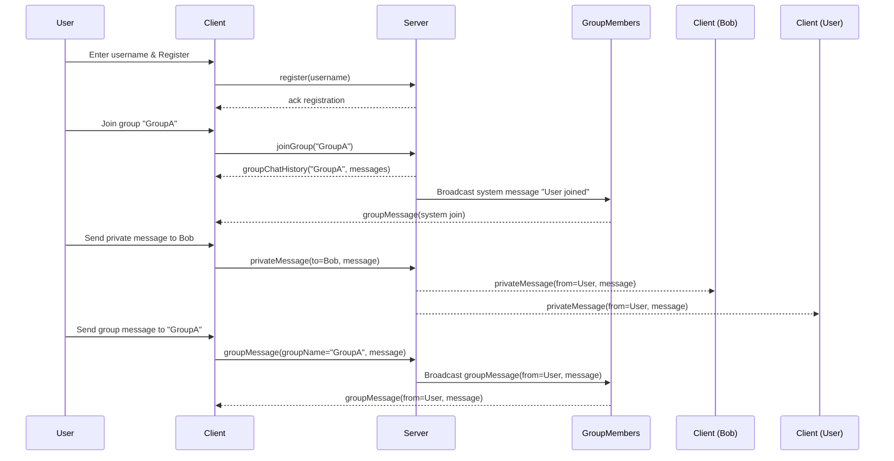

# Real-Time Messenger

## Overview

This project is a simple real-time messenger application supporting:

- **Private one-on-one messaging** between users  
- **Group chats** with multiple users  
- **Real-time message delivery** via WebSocket (Socket.io)  
- **Group chat history** stored server-side and sent on join  
- **Message deduplication** via unique IDs  
- Clean, responsive **Telegram-style UI** using Tailwind CSS

## Technology Stack

- **Backend:** Node.js with Express and Socket.io (TypeScript)  
- **Frontend:** Vanilla JavaScript + Tailwind CSS  
- **Communication:** WebSocket protocol via Socket.io  
- **Build tools:** TypeScript compiler (tsc), npm

## Project Structure
```
/project-root
│
├── server.ts           # Node.js server (TypeScript)
├── package.json
├── tsconfig.json
│
└── public/             # Static frontend assets
    ├── index.html      # Main HTML page with Tailwind UI
    └── client.js       # Client-side JS handling UI & socket logic
```

## Setup Instructions

### Prerequisites

- Node.js (v14+) and npm installed  
- `ts-node` installed globally or use npx to run TypeScript files

### Installation

```bash
npm init -y
npm install express socket.io
npm install -D typescript @types/node @types/express @types/socket.io ts-node
```

### Running the Server
- Compile and run with ts-node (development):
```bash
npx ts-node server.ts
```
- Or compile then run:
```bash
npx tsc
node dist/server.js

```

### Running the Client
- Serve the public folder statically via the Express server in server.ts (already configured)

- Open browser at http://localhost:3000

# How Server and Client Work Together

## Overview

The client and server communicate in real-time over WebSocket using the Socket.io library. The client provides a user interface for users to register, join groups, and send private or group messages. The server manages user sessions, group memberships, message broadcasting, and chat history storage.

## Key interactions

### User Registration

- Client sends a `register` event with a username to the server.  
- Server maps the username to the client’s socket connection.

### Joining a Group

- Client emits `joinGroup` with the group name.  
- Server adds the user to the group’s membership and socket.io room.  
- Server sends the stored chat history for that group back to the joining client.  
- Server broadcasts a system message to all group members notifying the join.

### Sending a Private Message

- Client emits `privateMessage` with recipient username and message.  
- Server looks up the recipient's socket and forwards the message (including the sender).  
- Server also sends the message back to the sender for consistency.

### Sending a Group Message

- Client emits `groupMessage` with group name and message content.  
- Server stores the message in group history with a unique ID.  
- Server broadcasts the message to all group members.

### Receiving Messages

- Clients listen for `privateMessage`, `groupMessage`, and `groupChatHistory` events.  
- Clients maintain a message cache with unique IDs to avoid duplicates and update UI accordingly.


### Sequence Diagram

[Mermaid Live](https://mermaid.live/edit#pako:eNqNVE2P2jAQ_SvWHCqQsihkIUAkkLq0alWJHrrqpcrFmwzBLbZT21mVIv57J180CKIlp3j83ps3M7aPkOgUIQKLvwtUCX4QPDNcxorRl3PjRCJyrhz7btFcR9d7gcpdx5_RvN7CfzK6yDcoX9DYWNX7pfLDalVLReyjcmhYQUHFJbJ37BtmwrpWrYYRvk4RMdNsD1rKsAbW-w8dZZ78atCGO6FVj4EvWiiWlUZZDJXh9zH0JP9J2Aoy-A_tzV9prnfcfSYL2hw6HI9JtJZnaC_Zq1W3YxF7MpqnCbeO2QMVLVsaOS2rqPxg2trtcq-MbGrmoBEqmcOejjyjSlluxCt3eM7oNHvSLz19acBtDqeXhD0X2dMhNiDQ8Iq8NVouS0dv80vUnQL9hdaj75T55im46Ge1-ErncHljvPdO90KxtwF3zfcmGzzIjEghcqZADyQaycslHEvlGNwOJcYQ0W-KW17sXVn8iWh0jX9oLVsmZcp2EG353tKqyFPqe_OGnCHUVDRrXSgH0TysJCA6wh9ajUePQTAN5uFiNp2E44UHB4o-jvwwmMwmYeDP_YU_Pnnwt8rpj-azqQeYCro_m_rlqh6w0z9uFp51)


